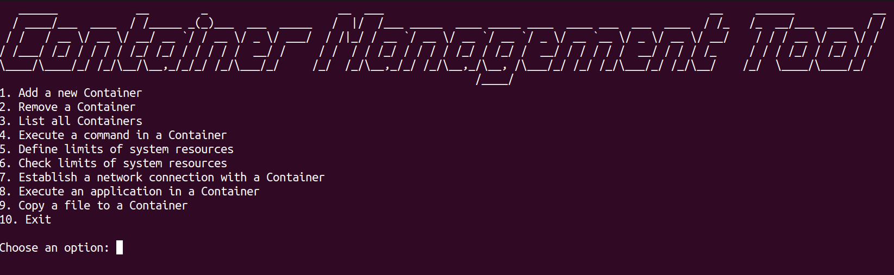
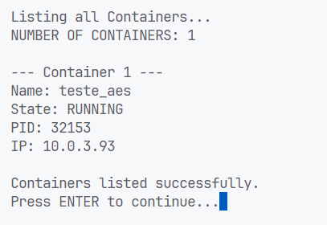
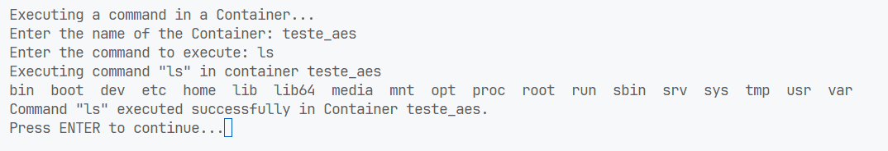
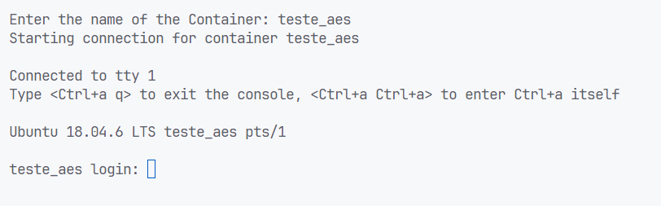
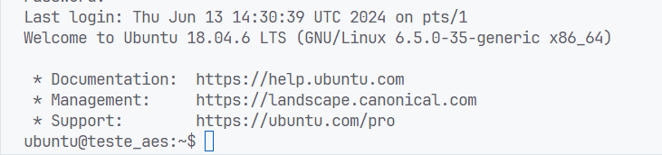
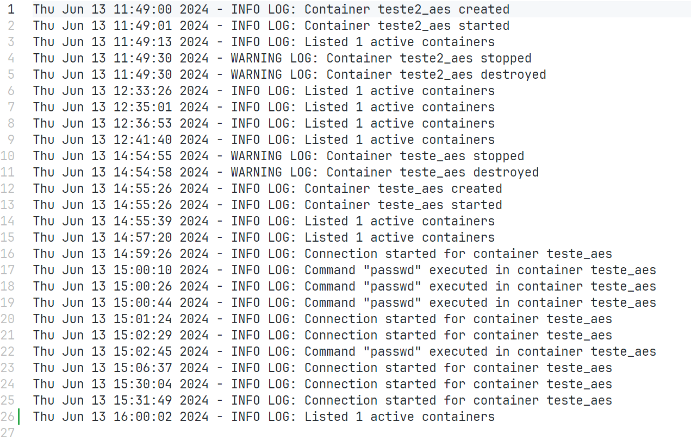

# *Container Management Tool*

## Autor(es)

- Simão Andrade: 118345

## Objetivos

Consiste na implementação de uma ferramenta de gestão, usando uma CLI (*Command Line Interface*), que permite executar aplicações num ambiente isolado (*container*) empregando *Linux Containers* (LXC), a funcionalidade *chroot*, *namespaces* e *cgroups*.

O uso de *namespaces*, garante que cada *container* tenha a sua própria visão isolada dos recursos do sistema, como PID's, interfaces de rede e montagens do sistema de arquivos.

O uso do *chroot* permite que o LXC altere o diretório raiz de um *container*, limitando o seu acesso a apenas um subconjunto do sistema de arquivos e aumentando a segurança acesso não autorizado a arquivos críticos do sistema.

Além disso, os *cgroups* desempenham um papel de gestão de recursos, impondo limites à CPU, memória, disco, I/O e largura de banda de rede para cada *container*.

O programa deve ser capaz de:

- [x] Criar/Remover *containers*;
- [x] Executar comandos num *container* (e.g. listar ficheiros) e visualizar o output;
- [x] Listar *containers* em execução;
- [x] Definir limites de recursos para um *container* (e.g. CPU, memória);
- [x] Copiar ficheiros para dentro de um *container*;
- [x] Estabelecer uma ligação com o *container*;
- [x] Executar aplicações num *container*.

Extras:

- [x] Criação de *logs* de atividade.
- [x] Dinamicamente alterar os limites de recursos de um *container*;

## Implementação

### Estrutura do Projeto

```console
├── docs/ -> Documentação do código
│   ├── html
│   └── latex
│
├── src/ -> Código fonte
│   ├── main.cpp -> Programa principal (CLI)
│   └── lib/ -> Bibliotecas
│       ├── lib.cpp -> Implementação das funcionalidades
│       └── lib.h -> Declaração das funcionalidades
│
├── img/ -> Imagens do projeto
│
├── video/ -> Vídeo de execução do programa
│   └── video.mp4
│
├── Doxyfile -> Configuração do Doxygen
├── Makefile -> Compilação do programa
└── README.md -> Descrição do projeto
```

### Interface

<p align="center"></p>

<p align="center"><i>Fig. 1 - Interface do programa</i></p>

### Funcionalidades

#### Criação de *containers*

Para criar um *container*, é chamada a seguinte função:

```cpp
int create_new_container(const char *container_name);
```

Cria um novo *container* com o nome especificado. O *container* é criado sob a distribuição *Ubuntu bionic*, com a arquitetura *amd64*. No final, é retornado o *PID* do *container*.

#### Remoção de *containers*

Para remover um *container*, é chamada a seguinte função:

```cpp
int remove_container(const char *container_name);
```

Remove o *container* com o nome especificado, encerrando primeiro o *container* caso esteja em execução. Se o *container* não existir, é retornado um erro.

#### Listagem de *containers* em execução

Para listar os *containers* em execução, é chamada a seguinte função:

```cpp
int list_running_containers();
```

Lista todos os *containers* em execução, mostrando o PID (*Process ID*), o nome e o IP de cada *container*.

<p align="center"></p>
<p align="center"><i>Fig. 2 - Listagem de containers</i></p>

> [!NOTE]
> O IP caso não esteja disponível, é mostrado como `N/A` (Not Available).

#### Execução de comandos num *container*

Para executar comandos num *container*, é chamada a seguinte função:

```cpp
int run_command_in_container(const char *container_name, char *command);
```

Executa o comando especificado no *container* com o nome especificado. De modo a conseguir executar o comando, é necessário que o *container* esteja em execução. O comando dado pode ter multiplos argumentos, então o mesmo é *tokenized* (usando o espaço como delimitador) e passado todos os argumentos para a função `attach_run_wait`, que executa o comando no *container* e espera que o mesmo termine.

<p align="center"></p>
<p align="center"><i>Fig. 3 - Execução do comando 'ls' no LXC container</i></p>

#### Estabelecer uma ligação com o *container*

Para estabelecer uma ligação com o *container*, é chamada a seguinte função:

```cpp
int start_connection(const char *container_name);
```

É feita via terminal com o *container* com o nome especificado. O terminal é aberto no *container* e é possível executar comandos diretamente no *container*.

<p align="center"></p>
<p align="center"><i>Fig. 4 - Registo para estabelecer ligação com o LXC container</i></p>

<p align="center"></p>
<p align="center"><i>Fig. 5 - Ligação com o LXC container estabelecida</i></p>

#### Definição de limites de recursos para um *container*

Para definir limites de recursos para um *container*, é chamada a seguinte função:

```cpp
int define_limits_of_system_resources(const char *container_name, const char *cgroup_subsystem, const char *cgroup_value);
```

Utiliza *cgroups* para definir limites de recursos para um *container*. O *cgroup_subsystem* é o subsistema do *cgroup* que se pretende limitar.

Neste caso, temos:

- `cpu.cfs_quota_us` para limitar a utilização da CPU;
- `memory.limit_in_bytes` para limitar a utilização da memória;
- `blkio.weight` para limitar a utilização do disco;
- `net_cls.classid` para limitar a utilização da largura de banda da rede.

O *cgroup_value* é o valor do limite que se pretende definir.

#### Copiar ficheiros para dentro de um *container*

Para copiar ficheiros para dentro de um *container*, é chamada a seguinte função:

```cpp
int copy_file_to_container(const char *container_name, const char *file_name);
```

Esta função copia o ficheiro especificado que esteja dentro da diretoria atual para o *container* com o nome especificado. Isto é feito copiando diretamente para o filesystem do *container*, o ficheiro (`~/.local/share/lxc/<container_name>/rootfs/`).

### Registo de atividade

Todo as atividades realizadas no programa são registadas num ficheiro de *log* (`logs.txt`). O ficheiro é criado (caso não exista) e as atividades são registadas com a data e hora em que foram realizadas.

Temos dois tipos de logs:

- `INFO` - Regista as atividades normais do programa;
- `WARNING` - Regista as atividades mais criticas que envolvem manipulação de *containers* e recursos.
- `ERROR` - Regista as atividades que resultaram em erro, de modo a reportar problemas e a ter um registo de uso.

<p align="center"></p>
<p align="center"><i>Fig. 3 - Registo de atividade</i></p>

## Documentação

A documentação do código foi feita com o *Doxygen*. Para gerar a documentação, basta executar o seguinte comando:

```bash
doxygen Doxyfile
```

A documentação será gerada na pasta `docs/`.

## Execução

Primeiramente, é necessário instalar o *LXC*:

```bash
sudo apt-get install lxc
```

Ou, atualizar o *LXC*, caso já esteja instalado:

```bash
sudo apt-get update
sudo apt-get upgrade lxc
```

E as bibliotecas de desenvolvimento do *LXC*:

```bash
sudo apt-get install lxc-dev
```

Para verificar se o *LXC* foi instalado corretamente, execute o seguinte comando:

```bash
lxc-checkconfig
```

Para ver os templates LXC disponíveis, execute o seguinte comando:

```bash
ls /usr/share/lxc/templates/
```

Para compilar o programa, basta executar os seguintes comandos:

```bash
make
./program
```

## Conclusão

O projeto foi desenvolvido com sucesso, conseguindo implementar as funcionalidades propostas.

## Referências

- [LXC (Linux Container)](https://linuxcontainers.org/lxc/documentation/)
- [CGroups](https://www.kernel.org/doc/Documentation/cgroup-v1/cgroups.txt)
- [Limiting Resources using CGroups](https://apptainer.org/docs/user/1.0/cgroups.html)
- [Chroot](https://man7.org/linux/man-pages/man1/chroot.1.html)
